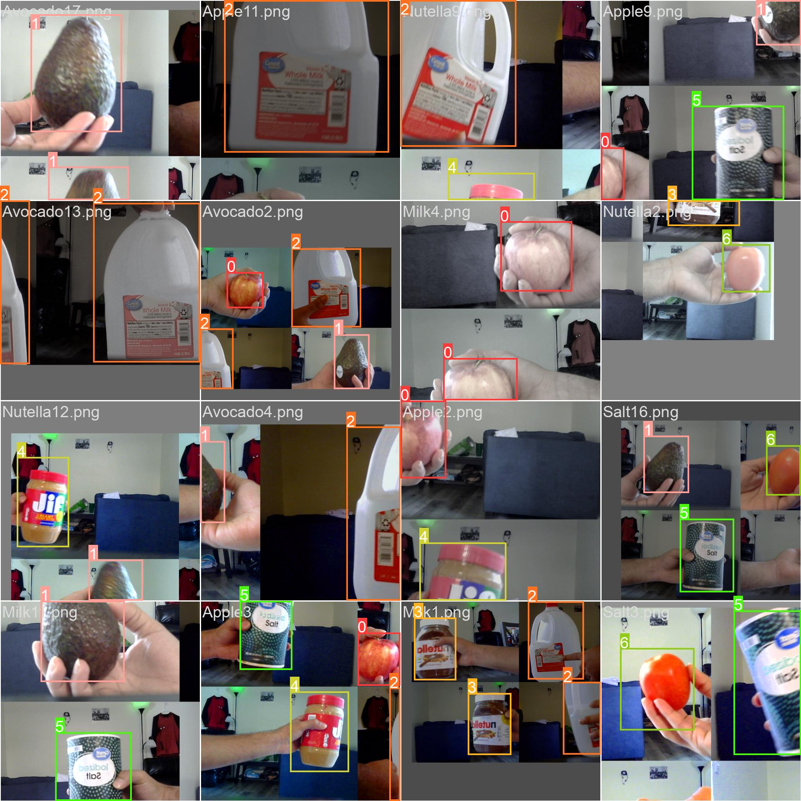

<h1>Programming for Internet of Things</h1>

A kitchen-based system that allows you to effortlessly add items to your grocery list. 
Simply show the food product to the camera, and it will automatically update your 'grocery cart'.  such as an Apples, water, yogurt,  cereal, oil, etc.

  
<h3>Model training</h3>

Training images - batch0

Training images - batch1

